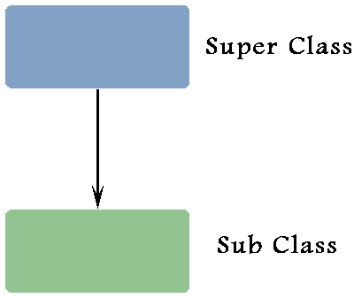
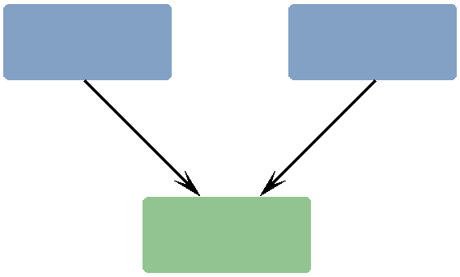

#### c++中的多重继承

**单继承**如下图



在单继承中，一个类继承另一个类。

**多级继承**如下图


在这种类型的继承中，一个类继承另一个类。这个基类继承自其他类。

**分层的继承**如下图


在层次继承中，多个类从基类继承。

**多重继承**如下图



在多重继承中，一个类可以继承多个类。简单来说，一个类可以有多个基类。这种类型的继承在Java中不存在。

假设我们必须创建两个类A和B作为类C的基类，那么我们必须像下面这样定义类C。

```C++
class C: public A, public B
{
        // code
};
```

实例如下
```C++
#include <iostream>

using namespace std;

class Area
{
	public:
		int getArea(int l, int b);

};

int Area::getArea(int l,int b)
{
	return l*b;
}

class Perimeter
{
	public:
		int getPerimeter(int l, int b);

};

int Perimeter::getPerimeter(int l, int b)
{
	return 2*(l + b);
}

class Rectangle : public Area, public Perimeter
{
	int length;
	int breadth;
	public:
		Rectangle():length(7),breadth(4){}

		int area();

		int perimeter();
};

int Rectangle::area()
{
	return Area::getArea(length, breadth);
}

int Rectangle::perimeter()
{
	return Perimeter::getPerimeter(length, breadth);
}

int main()
{
	Rectangle rt;
	cout << "Area : " << rt.area() << endl;
	cout << "Perimeter : " << rt.perimeter() << endl;
	return 0;
}

//OUTPUT
/*
Area : 28
Perimeter : 22
*/
```

在本例中，Rectangle类有两个基类Area和Perimeter。类“Area”有一个函数getArea(int l, int b)返回Area。类“Perimeter”有一个函数getPerimeter(int l, int b)返回Perimeter。

创建类Rectangle的对象“rt”时，调用它的构造函数，并将值7和4分别赋给它的数据成员length和width。然后，我们调用类Rectangle的函数area()，它返回类区域的getArea(length,breadth)，从而调用函数getArea(int l, int b)，并将值7和4分别赋值给l和b。这个函数返回长7宽4的Rectangle的面积。

Perimeter中的操作类似。

```C++
#include <iostream>

using namespace std;

class P1
{
	public:
		P1()
		{
			cout << "Constructor of P1" << endl;
		}
};

class P2
{
	public:
		P2()
		{
			cout << "Constructor of P2" << endl;
		}
};

class A : public P2, public P1
{
	public:
		A()
		{
			cout << "Constructor of A" << endl;
		}
};

int main()
{
	A a;
	return 0;
}
//OUTPUT:
/*
Constructor of P2
Constructor of P1
Constructor of A
*/
```

在这里，创建类a的对象a时，它的构造函数被调用。如前所述，编译器首先调用基类的构造函数。因为类'A'有两个基类'P1'和'P2'，所以这两个类的构造函数在执行'A'的构造函数体之前都会被调用。调用这两个基类的构造函数的顺序取决于以下代码。
`class A : public P2, public P1`

用构造函数的顺序取决于继承它们各自类的顺序。因为我们在public P1之前写了public P2，所以P2的构造函数会在P1的构造函数之前被调用。