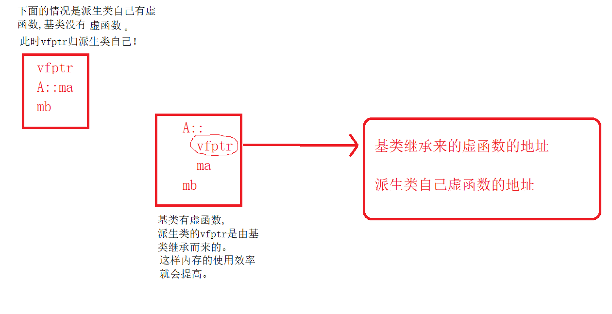
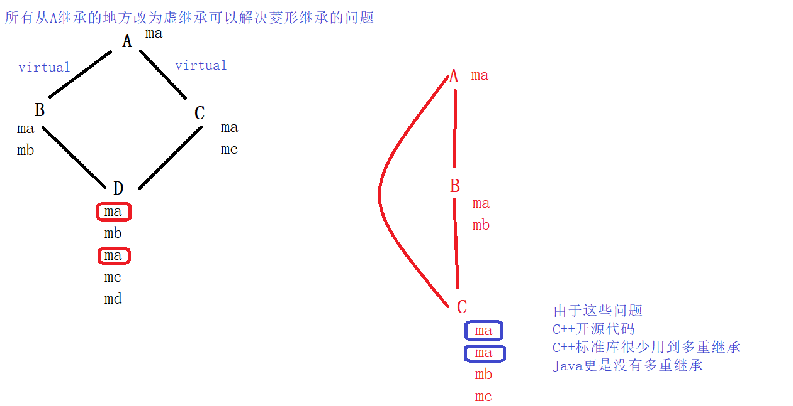

## 多继承

普通继承:

```c++
#include <iostream>
using namespace std;


class A
{
public:
private:
	int ma;
};
class B : public A
{
public:
private:
	int mb;
};
/*
A a; 4个字节
B b; ma,mb  8个字节=8个字节 
*/
```

多重继承 ：代码的复用   一个派生类有多个基类
```c++
class C: public A, public B
{
};
```
抽象类(有纯虚函数的类)/虚基类被虚继承的类称作虚基类 vbptr和vbtable
virtual
1.修饰成员方法是虚函数
2.可以修饰继承方式，是虚继承。被虚继承的类，称作虚基类

```c++
#include <iostream>
#include <cstdlib>
using namespace std;
/*
多重继承 ：代码的复用   一个派生类有多个基类
class C: public A, public B
{
};
抽象类(有纯虚函数的类) / 虚基类 被虚继承的类称作虚基类 vbptr和vbtable
virtual
1.修饰成员方法是虚函数
2.可以修饰继承方式，是虚继承。被虚继承的类，称作虚基类
*/
class A
{
public:
	virtual void func() { cout << "call A::func" << endl; }
	void operator delete(void *ptr)
	{
		cout << "operator delete p:" << ptr << endl;
		free(ptr);
	}
private:
	int ma;
};
class B : virtual public A
{
public:
	void func() { cout << "call B::func" << endl; }

	void* operator new(size_t size)
	{
		void *p = malloc(size);
		cout << "operator new p:" << p << endl;
		return p;
	}
private:
	int mb;
};
/*
A a; 4个字节
B b; ma,mb  8个字节+4=12个字节   多了4个字节是虚基类指针vbptr,vbptr指向虚基类表
*/
int main()
{
    #if 0
    A *p = new B(); // B::vftable
    p->func();
    delete p; // delete windows会出错,linux依然会出错
    #endif

	// 基类指针指向派生类对象，永远指向的是派生类基类部分数据的起始地址
	#if 1
    B b;
	A *p = &b;//new B(); // B::vftable
	cout << "main p:" << p << endl;
	p->func();
    #endif

	return 0;
}
```
上面代码打印:

```
main p:0x6ffe00
call B::func
```
为什么明明是A基类类型的指针只是指向了派生类对象调用函数却是派生类的函数呢?

上面代码内存布局如下:


那为什么这段代码会出错:

```c++
A *p = new B(); // B::vftable
p->func();
delete p; // delete windows会出错,linux依然会出错
```


还有一种特殊情况,派生类自己有虚函数,基类没有虚函数此时vfptr归派生类自己:



这里让我引用<剑指offer>
1. 情况1
```c++
class A{} sizeof(A) = 1
class B : public A{} sizeof(B) = 1
```
2. 基类添加一个虚函数
```c++
class A
{
virtual void fun(){}
}

class B : public A
{

}
sizeof(B) = 4 vfptr
```
3. B虚继承了带有虚函数的A
```c++
class B : virtual public A
{

}
sizeof(B) = 4 vfptr + 4 vbptr = 8
```
vfptr/vbptr 
vftable/vbtable 

类有虚函数,类就有vfptr指向vftable
派生类由基类虚继承来会有vbptr,vbtable放的是vbptr以及虚基类数据派生类的(关于继承来的数据)偏移量

## 多继承问题菱形继承

菱形继承问题如下图:



具体来说就是B和C由A派生而来,而D有时继承了B,C而产生的。这就造成了D有两份A的成员变量。

由于多继承有各种各样的问题,C++的标准库和开源很少用到多继承。Java则直接没有多继承。

```c++
#include <iostream>
using namespace std;
/*
C++的多重继承 - 菱形继承的问题  派生类有多份间接基类的数据 设计的问题
好处，可以做更多代码的复用   D -> B,C    B *p = new D()   C *p = new D()
*/
class A
{
public:
	A(int data) :ma(data) { cout << "A()" << endl; }
	~A() { cout << "~A()" << endl; }
protected:
	int ma;
};
//=======================================
class B : public A
{
public:
	B(int data) :A(data), mb(data) { cout << "B()" << endl; }
	~B() { cout << "~B()" << endl; }
protected:
	int mb;
};
class C : public A
{
public:
	C(int data) :A(data), mc(data) { cout << "C()" << endl; }
	~C() { cout << "~C()" << endl; }
protected:
	int mc;
};
//=========================================
class D : public B, public C
{
public:
	D(int data) : B(data), C(data), md(data) { cout << "D()" << endl; }
	~D() { cout << "~D()" << endl; }
protected:
	int md;
};
int main()
{
	D d(10);

	return 0;
}
```
上面代码打印
```
A()
B()
A()
C()
D()
~D()
~C()
~A()
~B()
~A()
```

可以明显看到A构造了两次.

怎么解决菱形问题,从A继承的地方改为虚继承即可。
解决如下:
```c++
#include <iostream>
using namespace std;
/*
C++的多重继承 - 菱形继承的问题  派生类有多份间接基类的数据 设计的问题
好处，可以做更多代码的复用   D -> B,C    B *p = new D()   C *p = new D()
*/
class A
{
public:
	A(int data) :ma(data) { cout << "A()" << endl; }
	~A() { cout << "~A()" << endl; }
protected:
	int ma;
};
//=======================================
class B : virtual public A
{
public:
	B(int data) :A(data), mb(data) { cout << "B()" << endl; }
	~B() { cout << "~B()" << endl; }
protected:
	int mb;
};
class C : virtual public A
{
public:
	C(int data) :A(data), mc(data) { cout << "C()" << endl; }
	~C() { cout << "~C()" << endl; }
protected:
	int mc;
};
//=========================================
class D : public B, public C
{
public:
	//没有通过A(data)初始化会报错 => “A::A”: 没有合适的默认构造函数可用
	D(int data) :A(data), B(data), C(data), md(data) { cout << "D()" << endl; }
	~D() { cout << "~D()" << endl; }
protected:
	int md;
};
int main()
{
	D d(10);

	return 0;
}
/*
OUTPUT:
A()
B()
C()
D()
~D()
~C()
~B()
~A()
*/

// A的构造只调用一次,只生成了一份ma。解决了菱形依赖问题。
```

## 四种类型转换

C++语言级别提供的四种类型转换方式

- int a = (int)b;
- const_cast : 去掉（指针或者引用）常量属性的一个类型转换
- static_cast :  提供编译器认为安全的类型转换（没有任何联系的类型之间的转换就被否定了）
- reinterpret_cast : 类似于C风格的强制类型转换(慎用)
- dynamic_cast : 主要用在继承结构中，可以支持RTTI类型识别的上下转换

其中move移动语义其实就是利用static_cast把对象强转为右值引用变量。