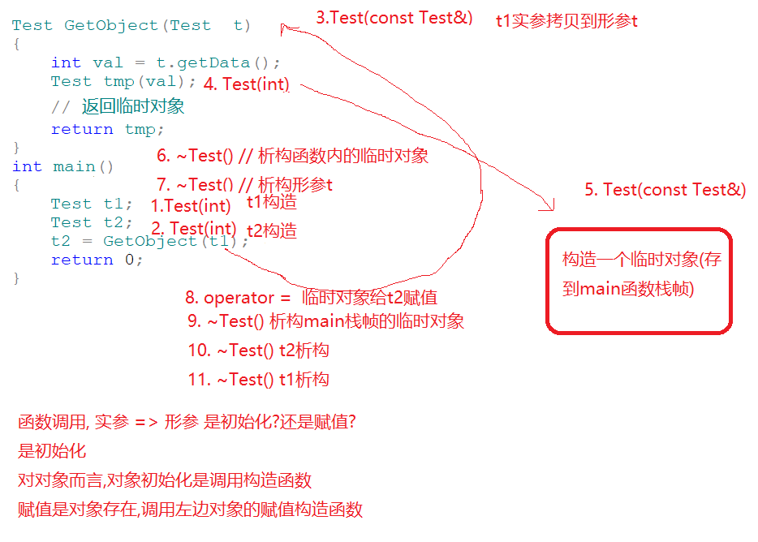
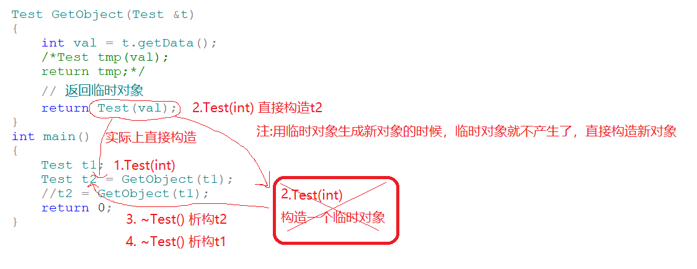

## C++对象的优化以及右值引用

C++由于有构造函数和析构函数会比C语言多出一定的调用。如果不去了解C++对象使用过程背后调用了那些方法就会写不出高性能的代码来发挥C++的性能优势。

换句话说,要掌握让代码尽可能少调用的方式。
直接看代码
```c++
#include <iostream>

using namespace std;
// 怎么让代码少调用?
class Test
{
public:
	Test(int a = 10) :ma(a)         // 构造函数
	{ cout << "Test(int)" << endl; }
	~Test()                         // 析构函数
	{ cout << "~Test()" << endl; }
	Test(const Test &t) :ma(t.ma)   // 拷贝构造函数
	{ cout << "Test(const Test&)" << endl; }
	Test& operator=(const Test &t)  // 赋值运算符重载函数
	{
		cout << "operator=" << endl;
		ma = t.ma;
		return *this;
	}
private:
	int ma; // 成员变量
};
int main()
{
	Test t1;	 // 调用构造函数
	Test t2(t1); // 调用拷贝构造函数
	Test t3 = t1;// 调用拷贝构造
	// Test(20) 显式生成临时对象  生存周期：所在的语句
	/*
	C++编译器对于对象构造的优化：用临时对象生成新对象的时候，临时对象
	就不产生了，直接构造新对象就可以了
	*/
	Test t4 = Test(20); // Test t4(20);没有区别的！
	cout << "--------------" << endl;

	// t4.operator=(t2) 
	t4 = t2;
	// t4.operator=(const Test &t)
	// 显式生成临时对象
	t4 = Test(30); // 构造完临时对象后,还需要给t4赋值。然后临时对象析构
	t4 = (Test)30; // int->Test(int) 强转编译器看有没有适合构造函数,Test的普通构造符合条件调用。显式转换

	// 隐式生成临时对象
	t4 = 30; // Test(30) int->Test(int)    char*->Test(char*)=>没有带char*的构造函数会报错

	// 指针,引用变量使用过程中临时对象析构过程
	cout << "--------------" << endl;
	Test *p = &Test(40);
	// p指向的是一个已经析构的临时对象,p除语句(Test *p = &Test(40);)外就不可用了=>不应该用指针保存临时对象
	const Test &ref = Test(50); // 引用变量引用一个临时变量
	cout << "--------------" << endl;
	return 0;
}
```
可以看到调用了非常多的函数。

再来看一个优化的例子:

```c++
#include <iostream>

class Test
{
public:
	// 带默认值参数的构造函数。Test()  Test(20)
	Test(int data = 10) :ma(data)
	{
		cout << "Test(int)" << endl;
	}
	~Test() // 析构函数
	{
		cout << "~Test()" << endl;
	}
	Test(const Test &t):ma(t.ma) // 拷贝构造函数
	{
		cout << "Test(const Test&)" << endl;
	}
	void operator=(const Test &t) // 赋值构造函数
	{
		cout << "operator=" << endl;
		ma = t.ma;				// 没有占用外部资源,浅拷贝也可
	}
	int getData()const { return ma; }
private:
	int ma;
};

Test GetObject(Test &t)    // &t作为形参相比值传递少了形参t的构造和析构函数调用
{
	int val = t.getData();
	/*Test tmp(val);
	return tmp;*/
	// 返回临时对象
	return Test(val);  
}
int main()
{
	Test t1;					// 1.Test(int)
	Test t2 = GetObject(t1);	// 2.Test(int)
	//t2 = GetObject(t1);
	return 0;
}
```
关注GetObject函数。我就修改它的形参,将其从引用变为按值传递。

```c++
Test GetObject(Test t)   
{
	int val = t.getData();
	// 返回临时对象
	return Test(val);  
}

int main()
{
	Test t1;					// 1.Test(int)
	Test t2 = GetObject(t1);	// 2.Test(int)
	//t2 = GetObject(t1);
	return 0;
}
```
此时函数的调用如下:

由图可知调用了11个函数，按值传递其实是为了保存形参的值会先构造一个临时变量保存形参t,然后出函数作用域又会调用其析构函数。这样写出来的代码有可能比python还慢。

优化后如下图利用了临时对象,只有4个函数调用。大大提升了效率


先解答一个疑问:
为什么GetObject不能返回局部的或者临时对象的指针或引用 => 返回指针或引用一定要保证返回的变量函数结束后还存在,如果返回指针,由于Test(val)是局部变量,函数执行结束函数栈回收就段错误了。

我们要得出以下结论:
1. 函数参数传递过程中，对象优先按引用传递，不要按值传递
2. 函数返回对象的时候，应该优先返回一个临时对象，而不要返回一个定义过的对象 => 
			因为 C++编译器对于对象构造的优化：用临时对象生成新对象的时候，临时对象就不产生了，直接构造新对象就可以了
3. 接收返回值是对象的函数调用的时候，优先按初始化的方式接收，不要按赋值的方式接收

## 右值引用的价值

那么知道了引用或指针传递的价值。为什么还需要右值引用。想一下如果我们的连临时变量都不传入直接把资源转交给t2那么是不是又少了两次函数的调用。main函数里面的t2根本不会被构造,直接通过GetObject拿到t1的资源。

右值引用就能达到这样的效果。

再来看如下的CMyString代码
```c++
#include <iostream>

using namespace std;
class CMyString
{
public:
	CMyString(const char *str = nullptr)
	{
		cout << "CMyString(const char*)" << endl;
		if (str != nullptr)
		{
			mptr = new char[strlen(str) + 1];
			strcpy(mptr, str);
		}
		else
		{
			mptr = new char[1];
			*mptr = '\0';
		}
	}
	~CMyString()
	{
		cout << "~CMyString" << endl;
		delete[]mptr;
		mptr = nullptr;
	}
	// 带左值引用参数的拷贝构造
	CMyString(const CMyString &str)
	{
		cout << "CMyString(const CMyString&)" << endl;
		mptr = new char[strlen(str.mptr) + 1];
		strcpy(mptr, str.mptr); 
		/*
		能否?
		mptr = str.mptr;
		str.mptr = nullptr;
		*/
	}
	// 带左值引用参数的赋值重载函数
	CMyString& operator=(const CMyString &str)
	{
		cout << "operator=(const CMyString&)" << endl;
		if (this == &str)
			return *this;

		delete[]mptr;

		mptr = new char[strlen(str.mptr) + 1];
		strcpy(mptr, str.mptr);
		return *this;
	}
	const char* c_str()const { return mptr; }
private:
	char *mptr;
};


// 普通的左值拷贝构造函数存在一个问题:
// 如果我想写一个函数:
CMyString GetString(CMyString &str)
{
	const char* pstr = str.c_str();
	CMyString tmpStr(pstr);
	return tmpStr;
}
int main()
{
	CMyString str1("aaaaaaaaaaaaaaaaaaaa");
	CMyString str2;
	str2 = GetString(str1);
	cout << str2.c_str() << endl;
	return 0;
}
// main函数打印如下:
// CMyString(const char*)
// CMyString(const char*)
// CMyString(const char*)
// CMyString(const CMyString&) => tmpStr拷贝构造main函数栈帧上的临时对象
// ~CMyString
// operator=(const CMyString&) => main函数栈帧上的临时对象给t2赋值
// ~CMyString
// aaaaaaaaaaaaaaaaaaaa
// ~CMyString
// ~CMyString
// 注意:CMyString(const CMyString&)这两个打印
// 	说明GetString函数会开辟临时空间用来存储CMyString的指针变量mptr,调用了拷贝,构造,赋值等函数将临时变量传递给了main函数后再销毁再把临时指针置为空。
// 	那为什么不直接把开辟的临时指针控制权交给main函数呢？
```
看到最上面的注释了吗?GetString函数会开辟临时空间用来存储CMyString的指针变量mptr,调用了拷贝,构造,赋值等函数将临时变量传递给了main函数后再销毁再把临时指针置为空。那为什么不直接把开辟的临时指针控制权交给main函数呢？

什么是右值:

```c++
int &&d = 20; // 可以把一个右值绑定到一个右值引用上
CMyString &&e = CMyString("aaa"); // e是右值,字符串aaa是临时变量
```
接下来可以直接看源代码 [带move构造函数的CMyString](https://github.com/helintongh/CplusplusQuickGuide/blob/master/src/08%E4%BC%98%E5%8C%96%E5%AF%B9%E8%B1%A1%E9%AB%98%E6%95%88CPP%E7%BC%96%E7%A8%8B/03_2%E5%B8%A6%E5%8F%B3%E5%80%BC%E5%BC%95%E7%94%A8%E5%8F%82%E6%95%B0%E7%9A%84%E6%8B%B7%E8%B4%9D%E6%9E%84%E9%80%A0%E5%92%8C%E8%B5%8B%E5%80%BC%E5%87%BD%E6%95%B0%E7%9A%84CMyString.cpp)

[CMyString的重载运算符的优化](https://github.com/helintongh/CplusplusQuickGuide/blob/master/src/08%E4%BC%98%E5%8C%96%E5%AF%B9%E8%B1%A1%E9%AB%98%E6%95%88CPP%E7%BC%96%E7%A8%8B/03_3CMyString%E5%8A%A0%E6%B3%95%E9%87%8D%E8%BD%BD%E8%BE%93%E5%87%BA%E9%87%8D%E8%BD%BD%E8%BF%90%E7%AE%97%E7%AC%A6%E7%9A%84%E5%AE%9E%E7%8E%B0%E5%92%8C%E4%BC%98%E5%8C%96.cpp)

左值
```c++
CMyString(const CMyString &str)
{
	cout << "CMyString(const CMyString&)" << endl;
	mptr = new char[strlen(str.mptr) + 1];
	strcpy(mptr, str.mptr);
}
CMyString& operator=(const CMyString &str)
{
	cout << "operator=(const CMyString&)" << endl;
	if (this == &str)
		return *this;

	delete[]mptr;

	mptr = new char[strlen(str.mptr) + 1];
	strcpy(mptr, str.mptr);
	return *this;
}
```
右值
```c++
CMyString(CMyString &&str) // str引用的就是一个临时对象
{
	cout << "CMyString(CMyString&&)" << endl;
	mptr = str.mptr;
	str.mptr = nullptr; // 临时变量要置为空(销毁)
}
CMyString& operator=(CMyString &&str) // 临时对象
{
	cout << "operator=(CMyString&&)" << endl;
	if (this == &str)
		return *this;

	delete[]mptr;

	mptr = str.mptr;
	str.mptr = nullptr;
	return *this;
}
```

注意看上面两个函数。右值根本没有重新new空间,或者重写拷贝相应的代码而仅仅是转移了源指针给要赋值的地方。

## move移动语义和forward类型完美转发

前面讲过了move移动语义就是强制转换为右值。

那么forward类型是干什么用的?上面的CMyString源码看了过后是不是很崩溃,又要写左值的构造,赋值构造,拷贝构造。还要写右值的。这都还算好,那如果是vector这种迭代器。还要给push_back实现接收右值的版本和接收左值的版本。这会不会太过于复杂了。

基于此C++新增了新特性forward类型完美转发,能够识别左值和右值类型。

我实现了一个近乎完整的vector [源码](https://github.com/helintongh/CplusplusQuickGuide/blob/master/src/08%E4%BC%98%E5%8C%96%E5%AF%B9%E8%B1%A1%E9%AB%98%E6%95%88CPP%E7%BC%96%E7%A8%8B/03_5move%E7%A7%BB%E5%8A%A8%E8%AF%AD%E4%B9%89%E5%92%8Cforward%E7%B1%BB%E5%9E%8B%E5%AE%8C%E7%BE%8E%E8%BD%AC%E5%8F%91vector.cpp)

让我来讲解下关键代码:

```c++
void push_back(const T &val) // 接收左值
{
	if (full())
		expand();
	_allocator.construct(_last, val);
	_last++;
}
void push_back(T &&val) // 接收右值 一个右值引用变量本身还是一个左值。
{
	if (full())
		expand();
	// 如果语句是_allocator.construct(_last, val);尽管能接收临时对象,但construct依然匹配左值。(因为右值引用本身还是左值)
	_allocator.construct(_last, std::move(val)); // move移动语义把val强转为右值引用类型
	_last++;
}
```
forward完美转发
```c++
template<typename Ty> // 函数模板的类型推演 + 引用折叠
void push_back(Ty &&val) //Ty CMyString& + && = CMyString& ==> 一个引用+两个引用 还是左值。两个引用+两个引用 才是右值
{
	if (full())
		expand();

	// move(左值)：移动语义，得到右值类型   (int&&)a
	// forward:类型完美转发，能够识别左值和右值类型
	_allocator.construct(_last, std::forward<Ty>(val)); // 变量本身得有推演功能
	_last++;
}
```

main函数如下:

```c++
int main()
{
	CMyString str1 = "aaa";
	vector<CMyString> vec;

	cout << "-----------------------" << endl;
	vec.push_back(std::move(str1)); // CMyString&& -> 被move强转为右值了
	vec.push_back(CMyString("bbb"));   // CMyString&& move  forword
	cout << "-----------------------" << endl;

	return 0;
}
```
可以看到是能够自行匹配的。

